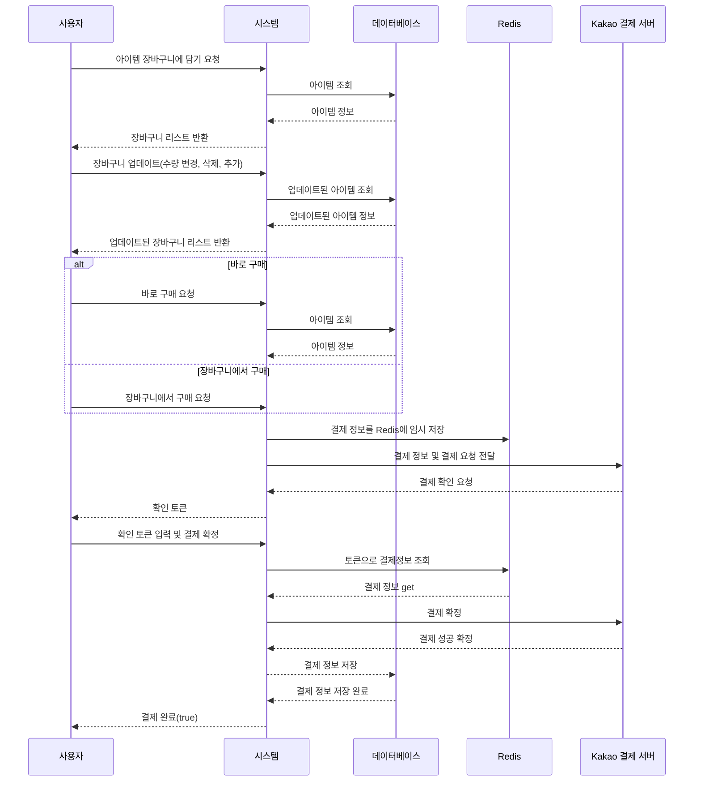

# TT Market - Tomorrow to Twentydays Market
<br />
<br />
<br />
<br />

<br />
<br />
<br />
<br />

## 프로젝트 기획 의도


다음날부터 2주 후까지의 가격을 제공한다고해서 Tomorrow to Twentydays <br />
즉, TT Market 입니다. <br />
<br />
TT Market은 다양한 데이터 분석을 통해 농산물 가격을 예측하고, <br />
사용자가 효과적인 구매 결정을 할 수 있도록 돕는 통합 쇼핑몰 서비스를 생각하고 제작하였습니다. <br />
<br />
일조량, 강수량, 온도, 기존 시세를 분석하여 농산물 가격 변동을 예측하는 알고리즘을 머신러닝으로 구현하고,
<br />
이를 통해 사용자들이 합리적인 구매 결정을 내릴 수 있도록 메타데이터를 제공했습니다.

또한, 사용자 리뷰 공유와 레시피 서비스를 제공하여 농산물을 효과적으로 활용할 수 있도록 하였습니다.<br />
<br />
이러한 정보들과 서비스들을 통해 TT Market에서 사용자들은 농산물 구매에서 보다 정보에 기반한 결정을 내릴 수 있게 돕는 것이 이 프로젝트의 기획 의도입니다.<br />


---


<br />
<br />

## Tech Stack

#### Frontend


#### Backend


#### Database


#### Deploy


---

<br />
<br />


## 기능 요약


일반 사용자가 사용 가능한 기능은 계정 관련 상품 구매나 리뷰 정도로 이루어져 있습니다.

<br /><br />

관리자 사용자는 일반 사용자의 기능에서 상품 등록이나 수정에 관한 기능이 추가되어 있습니다.

---

<br />
<br />


## 팀원 구성

| 정다운(팀장) | 유경우 | 김형진 | 윤주아 |
|:---:|:---:|:---:|:---:|
|  |  |  |  |
| [GitHub](https://github.com/jeongdawun) | [GitHub](https://github.com/ryukyungwoo) | [GitHub](https://github.com/bbbii) | [GitHub](https://github.com/dbswndk) |


---

<br />
<br />

## 진행 일정

#### 2023년 8월 1일 → 2023년 10월 6일


1주차: 프로젝트의 초기 설정 및 서비스 기획 시작.<br />
2주차: 개발 환경 설정과 CI/CD 구축을 시작하여 서비스 기획 계속 진행.<br />
3주차부터 7주차: 주된 구현 기간으로, 프로젝트의 핵심 부분을 개발.<br />
8주차: 최종 점검을 실시하여 프로젝트를 마무리.<br />
9주차: 발표 준비와 최종 발표<br />


---


<br />
<br />

## 일정 관리

<details>
<summary>효율적인 회의 운영 전략</summary>

    
 <br />
롱텀 회의와 일일 회의를 나누어 당주의 목표, 당일의 목표를 정하였고였습니다.<br />
롱텀 회의에서는 프로젝트의방향과 협력 필요성 등을 논의 하였고, <br />
일일 회의는 15분간 진행함으로써 당일의 간단한 목표와 이슈등을 공유하여 <br />
현재 목표에만 집중 할 수 있도록 하였습니다.<br />
그리고 회의록을 작성하여 당주, 당일의 목표를 쉽게 볼 수 있도록 하였습니다. <br />

</details>
<br />

<details>
<summary>업무 진행사항의 명확한 파악</summary>

 <br />
여기에는 팀의 To-Do 리스트, 진행 중인 작업, 완료된 작업 등을 구분하여,<br />

팀의 업무 진행사항을 한번에 파악 할 수 있도록 하여

협업 능력을 끌어올렸습니다<br />


</details>
<br />

<details>
<summary>작업의 우선순위 및 진행 상태 관리</summary>

 <br />
할 일 목록이 우선순위별로(P1, P2, P3, P4 등) 분류되어 있고, <br />

각각의 작업에 대한 진행 상태(예: '진행 중', '대기 중', '완료' 등)가 표시되어 있어 작업의 중요성과 긴급성을 한눈에 파악할 수 있습니다. <br />

이렇게 하여 가장 중요한 작업에 집중하고, 자원을 효과적으로 배분하며, 프로젝트의 진행을 효율적으로 관리할 수 있었습니다. <br />


</details>
<br />


---

<br />
<br />

## 역할 분담

### 🌐 유경우 | Spring & Machine Learning
- 구글, 네이버 로그인 관련 기능
- 카카오 페이와 관련된 결제 및 환불 처리
- 상품, 공동구매, 문의 기능 구현 및 예외 처리
- 데이터 분석 및 모델링 작업

### 🎨 윤주아 | React
- 마이페이지, 상품 페이지 기능 구현
- 사용자 문의 및 리뷰 기능 개발
- 이벤트 상품 페이지 작업

### 🔧 김형진 | React 
- 로그인, 회원 관리 및 프로필 기능 구현
- OAuth 및 상품 관련 기능 구현
- 조율 및 장바구니 기능 개발

### 👩‍💼 정다운 | Spring & React & Infra
- 농산물 가격 예측 및 레시피 관련 작업
- 관리자 페이지 및 UI 컴포넌트 개발
- 인프라 설정 및 CI/CD 파이프라인 구축


---


<br />
<br />

## 프로젝트 기능 설명

<details>
<summary><strong>시작 화면</strong></summary>
<br />  
서비스에 들어오면 상단에는 카테고리, 중단에는 크로셀과 신상품 알림, 하단에는 가격 예측 테이블이 위치하고 있습니다.<br /><br />
- 신상품 알림: <br /><br /> 최근에 등록된 상품 4개가 추천됩니다.<br /><br />
- 가격 예측 테이블: <br /> <br /> 표와 그래프 모드를 전환할 수 있는 토글과 각종 야채의 종류에 따라 그래프색이 달라집니다.<br /><br />
</details>
<details>
<summary><strong>회원가입 및 로그인</strong></summary>
<br />  
회원 가입 및 로그인은 모두 oauth로 진행하도록 하였습니다. 최초 가입시 oauth 서버에서 최소한의 정보만 가져오게 하고, 전화번호나 주소 등 나머지 정보는 사용자의 의지에 따라 입력하도록 하였습니다.<br /><br />
</details>
<details>
<summary><strong>상품 리스트</strong></summary>

<br />  
상품리스트는 상품의 재배 방법과 어떤 농가에서 생산된 제품인지, 제품 이미지와 리뷰 및 할인률을 볼 수 있습니다. 생산지나 재배 방법, 야채의 종류에 따라 필터링이 가능합니다.<br /><br />
</details>
<details>
<summary><strong>공동구매</strong></summary>
<br />  
공동 구매 상품은 달성량에 따라 할인률이 커지는 상품입니다. 현재 참여인원과 남은 일자를 볼 수 있습니다.<br /><br />
</details>
<details>
<summary><strong>상품 상세보기</strong></summary>
<br />  
상품 상세보기 페이지에서는 대표 이미지와 상세 이미지들, 기본적인 옵션, 개수 등을 지정하여 장바구니에 넣거나 바로 구입할 수 있습니다.<br /><br />
<br />  
하단에는 상품 상세 설명을 등록자가 직접 기입할 수 있습니다.<br /><br />
</details>
<details>
<summary><strong>장바구니</strong></summary>
<br />  
사용자가 상품을 담으면 리스트 형태로 서버에 임시 저장되며, 체크 박스와 -, + 버튼으로 상품의 상태를 업데이트 및 삭제할 수 있습니다. 가격 밑에는 전체상품 주문과 선택 상품 주문 버튼을 나누어 선택적 주문을 할 수 있게 하였습니다.<br /><br />
</details>
<details>
<summary><strong>주문하기</strong></summary>
<br />  
주문하기 페이지에서는 장바구니의 상품을 주문할 수 있으며, 주소나 전화번호 등 사용자 정보를 기입하거나 업데이트 할 수 있습니다.<br /><br />
<br />  
결제는 카카오 결제 API를 사용하였습니다.<br /><br />
</details>
<details>
<summary><strong>주문 목록</strong></summary>
<br />  
주문한 상품에 따라 배송중이라면 주문 취소 요청 버튼이, 주문이 완료되었다면 환불 버튼이 나옵니다. 리뷰하기 버튼도 주문 완료 후 활성화됩니다.<br /><br />
</details>
<details>
<summary><strong>레시피</strong></summary>
<br />  
레시피 페이지에서는 요리의 제목과 이미지, 조리 내용 등을 기입할 수 있습니다. 댓글 기능을 통해 사용자 간 의견을 나눌 수 있습니다.<br /><br />
</details>
<details>
<summary><strong>문의하기</strong></summary>
<br />  
사용자는 관리자에게 문의를 남길 수 있으며, 답변 완료 시 이메일 알림을 받습니다.<br /><br />
<br />  
자신이 문의했던 내용과 답변을 확인할 수 있습니다.<br /><br />
</details>
<details>
<summary><strong>관리자 페이지</strong></summary>
<br />  
관리자는 메인 페이지에서 상품의 등록 현황, 주문 목록 등을 확인하고, 상품, 판매자, 주문 관리 등을 할 수 있습니다.
<br />  <br />  
</details>


---


<br />
<br />


## 시퀀스 다이어그램 예시





<details>
<summary><strong>상품 결제 과정 예시</strong></summary>
<p>

상기의 시퀀스 다이어그램은 사용자가 시스템을 통해 상품을 장바구니에 담고, 장바구니를 업데이트한 후 결제하는 과정을 단계별로 나타낸 것입니다. 

- **장바구니 관리**
  - 사용자는 상품을 장바구니에 추가하거나 장바구니 내 상품의 수량을 변경, 삭제 혹은 추가할 수 있습니다.
  - 시스템은 데이터베이스를 통해 아이템 정보를 조회하고, 사용자에게 장바구니의 최신 상태를 반영하여 보여줍니다.

- **결제 요청**
  - 사용자가 '바로 구매' 혹은 '장바구니에서 구매' 옵션 중 하나를 선택합니다.
  - 시스템은 결제 정보를 Redis에 임시로 저장하고 Kakao 결제 서버에 결제를 요청합니다.
  - 사용자는 시스템으로부터 받은 확인 토큰을 이용하여 결제를 확정합니다.

- **결제 완료 처리**
  - Kakao 결제 서버로부터 결제 성공의 확정을 받은 시스템은 결제 정보를 데이터베이스에 저장합니다.
  - 결제 과정이 완료되면 사용자에게 결제 완료를 알리며, 이는 성공적인 결제 흐름을 의미합니다.

</p>
</details>

---


<br />
<br />


## 백엔드 계층 구조

<details>
    
```markdown

├─main
│  ├─java
│  │  └─com
│  │      └─dyes
│  │          └─backend
│  │              ├─config
│  │              ├─domain
│  │              │  ├─admin
│  │              │  │  ├─controller
│  │              │  │  │  └─form
│  │              │  │  ├─entity
│  │              │  │  ├─repository
│  │              │  │  └─service
│  │              │  │      └─request
│  │              │  ├─authentication
│  │              │  │  ├─controller
│  │              │  │  └─service
│  │              │  │      ├─google
│  │              │  │      │  └─response
│  │              │  │      ├─kakao
│  │              │  │      │  ├─response
│  │              │  │      │  └─service
│  │              │  │      └─naver
│  │              │  │          └─response
│  │              │  ├─cart
│  │              │  │  ├─controller
│  │              │  │  │  └─form
│  │              │  │  ├─entity
│  │              │  │  ├─repository
│  │              │  │  └─service
│  │              │  │      ├─reponse
│  │              │  │      └─request
│  │              │  ├─delivery
│  │              │  │  ├─controller
│  │              │  │  │  └─form
│  │              │  │  ├─entity
│  │              │  │  ├─repository
│  │              │  │  └─service
│  │              │  │      └─request
│  │              │  ├─event
│  │              │  │  ├─controller
│  │              │  │  │  └─form
│  │              │  │  ├─entity
│  │              │  │  ├─repository
│  │              │  │  └─service
│  │              │  │      ├─request
│  │              │  │      │  ├─delete
│  │              │  │      │  ├─modify
│  │              │  │      │  └─register
│  │              │  │      └─response
│  │              │  ├─farm
│  │              │  │  ├─controller
│  │              │  │  │  └─form
│  │              │  │  ├─entity
│  │              │  │  ├─repository
│  │              │  │  └─service
│  │              │  │      ├─request
│  │              │  │      └─response
│  │              │  │          └─form
│  │              │  ├─farmproducePriceForecast
│  │              │  │  ├─controller
│  │              │  │  │  └─form
│  │              │  │  ├─entity
│  │              │  │  ├─repository
│  │              │  │  └─service
│  │              │  │      ├─request
│  │              │  │      └─response
│  │              │  ├─inquiry
│  │              │  │  ├─controller
│  │              │  │  │  └─form
│  │              │  │  ├─entity
│  │              │  │  ├─repository
│  │              │  │  └─service
│  │              │  │      ├─request
│  │              │  │      └─response
│  │              │  │          └─read
│  │              │  ├─order
│  │              │  │  ├─controller
│  │              │  │  │  └─form
│  │              │  │  ├─entity
│  │              │  │  ├─repository
│  │              │  │  └─service
│  │              │  │      ├─admin
│  │              │  │      │  └─response
│  │              │  │      │      └─form
│  │              │  │      └─user
│  │              │  │          ├─request
│  │              │  │          └─response
│  │              │  │              └─form
│  │              │  ├─payment
│  │              │  │  ├─entity
│  │              │  │  ├─repository
│  │              │  │  └─service
│  │              │  │      ├─request
│  │              │  │      └─response
│  │              │  ├─product
│  │              │  │  ├─controller
│  │              │  │  │  ├─admin
│  │              │  │  │  │  └─form
│  │              │  │  │  └─user
│  │              │  │  ├─entity
│  │              │  │  ├─repository
│  │              │  │  └─service
│  │              │  │      ├─admin
│  │              │  │      │  ├─request
│  │              │  │      │  │  ├─delete
│  │              │  │      │  │  ├─modify
│  │              │  │      │  │  └─register
│  │              │  │      │  └─response
│  │              │  │      │      └─form
│  │              │  │      └─user
│  │              │  │          └─response
│  │              │  │              └─form
│  │              │  ├─recipe
│  │              │  │  ├─controller
│  │              │  │  │  └─form
│  │              │  │  ├─entity
│  │              │  │  ├─repository
│  │              │  │  └─service
│  │              │  │      ├─request
│  │              │  │      └─response
│  │              │  │          └─form
│  │              │  ├─review
│  │              │  │  ├─controller
│  │              │  │  │  └─form
│  │              │  │  ├─entity
│  │              │  │  ├─repository
│  │              │  │  └─service
│  │              │  │      ├─request
│  │              │  │      └─response
│  │              │  │          └─form
│  │              │  └─user
│  │              │      ├─controller
│  │              │      │  └─form
│  │              │      ├─entity
│  │              │      ├─repository
│  │              │      └─service
│  │              │          ├─request
│  │              │          └─response
│  │              │              └─form
│  │              └─utility
│  │                  ├─common
│  │                  ├─nickName
│  │                  ├─number
│  │                  ├─provider
│  │                  └─redis
│  └─resources
└─test
    └─java
        └─com
            └─dyes
                └─backend
                    ├─adminTest
                    ├─cartTest
                    ├─eventTest
                    ├─farmproducePriceForecastTest
                    ├─farmTest
                    ├─inquiryTest
                    ├─orderTest
                    ├─paymentTest
                    ├─productTest
                    │  ├─admin
                    │  └─user
                    ├─reviewTest
                    └─userTest
```

도메인별 구분을 통해 각 기능과 책임을 명확히 하여 객체 지향 설계를 강화했습니다.  <br />

컨트롤러, 서비스, 레포지토리를 각 도메인별로 분리함으로써 캡슐화와 응집도를 높이고, 코드의 가독성과 유지보수성을 향상시켰습니다.  <br />

또한, 도메인별로 분리된 단위 테스트를 통해 각 컴포넌트의 독립적인 기능 검증을 강화하고, 시스템의 안정성을 보장하도록 하였습니다. <br />


</details>

---


<br />
<br />


## 주요 API Spec

<details>
<summary><strong>관리자의 상품 등록 - POST /product/admin/register</strong></summary>

- **HTTP Method**: `POST`
- **URL**: `/product/admin/register`
- **Request JSON**:
    ```json
    {
        "userToken": "사용자_토큰_값",
        "productRegisterRequest": {
            "productName": "테스트상품2",
            "productDescription": "테스트다2",
            "cultivationMethod": "PESTICIDE_FREE",
            "produceType": "VEGETABLE"
        },
        "productOptionRegisterRequest": [
            {
                "optionName": "양파 1KG",
                "optionPrice": 56000,
                "stock": 10,
                "value": 1,
                "unit": "KG"
            },
            {
                "optionName": "양파 2KG",
                "optionPrice": 160000,
                "stock": 10,
                "value": 2,
                "unit": "KG"
            }
        ],
        "productMainImageRegisterRequest": {
            "mainImg": "main_image_onion.jpg"
        },
        "productDetailImagesRegisterRequests": [
            {
                "detailImgs": "onion_detail_image1.jpg"
            },
            {
                "detailImgs": "onion_detail_image2.jpg"
            }
        ],
        "farmName": "농장명"
    }
    ```
- **Return JSON**:
    ```json
    {
        "success": true
    }
    ```
</details>


<details>
<summary><strong>관리자의 상품 읽기(상세 정보) - GET /product/admin/read/{productId}</strong></summary>

- **HTTP Method**: `GET`
- **URL**: `/product/admin/read/{productId}`
- **Path Variable**: `productId` - 상품의 고유 ID
- **Return JSON**:
  ```json
  {
    "productResponseForAdmin": {
      "productId": 1,
      "productName": "상품명",
      "productDescription": "상품 설명",
      "cultivationMethod": "CULTIVATION_METHOD",
      "produceType": "PRODUCE_TYPE",
      "productSaleStatus": "SALE_STATUS"
    },
    "optionResponseForAdmin": [
      {
        "optionId": 1,
        "optionName": "옵션명",
        "optionPrice": 10000,
        "stock": 100,
        "value": 1,
        "unit": "UNIT",
        "optionSaleStatus": "SALE_STATUS"
      }
    ],
    "mainImageResponseForAdmin": {
      "mainImageId": 1,
      "mainImg": "메인 이미지 URL"
    },
    "detailImagesForAdmin": [
      {
        "detailImageId": 1,
        "detailImgs": "상세 이미지 URL"
      }
    ],
    "farmInfoResponseForAdmin": {
      "farmId": 1,
      "farmName": "농장 이름",
      "csContactNumber": "고객센터 번호",
      "farmAddress": {
        "address": "농장 주소",
        "zipCode": "우편번호",
        "detail": "상세 주소"
      },
      "mainImage": "농장 메인 이미지 URL",
      "introduction": "농장 소개",
      "produceTypes": ["PRODUCE_TYPE"]
    },
    "farmOperationInfoResponseForAdmin": {
      "farmOperationId": 1,
      "businessName": "사업자 명",
      "businessNumber": "사업자 번호",
      "representativeName": "대표자 이름",
      "representativeContactNumber": "대표자 연락처"
    }
  }
</details>


<details>
<summary><strong>레시피 읽기 - GET /recipe/read/{recipeId}</strong></summary>

- **HTTP Method**: `GET`
- **URL**: `/recipe/read/{recipeId}`
- **Path Variable**: 
  - `recipeId` - 레시피의 고유 ID
- **Return JSON**:
  ```json
  {
    "nickName": "닉네임",
    "recipeRegisterRequest": {
      "recipeName": "레시피 이름"
    },
    "recipeContentRegisterRequest": {
      "recipeDetails": ["레시피 단계별 설명"],
      "recipeDescription": "레시피 간략한 설명",
      "cookingTime": "조리 시간",
      "difficulty": "난이도"
    },
    "recipeCategoryRegisterRequest": {
      "recipeMainCategory": "레시피 주 카테고리",
      "recipeSubCategory": "레시피 부 카테고리"
    },
    "recipeIngredientRegisterRequest": {
      "servingSize": 4,
      "mainIngredient": "주 재료",
      "mainIngredientAmount": "주 재료 양",
      "otherIngredientList": [
        {
          "ingredientName": "기타 재료 이름",
          "ingredientAmount": "기타 재료 양"
        }
      ],
      "seasoningList": [
        {
          "ingredientName": "양념 이름",
          "ingredientAmount": "양념 양"
        }
      ]
    },
    "recipeMainImageRegisterRequest": {
      "recipeMainImage": "레시피 메인 이미지 URL"
    }
  }
</details>


<details>
<summary><strong>사용자의 문의 리스트 읽기 - GET /inquiry/user-list/{userToken}</strong></summary>

- **HTTP Method**: `GET`
- **URL**: `/inquiry/user-list/{userToken}`
- **Path Variable**: 
  - `userToken` - 사용자 토큰
- **Return JSON**:
  ```json
  [
    {
      "inquiryId": 1,
      "title": "문의 제목",
      "inquiryType": "문의 유형",
      "inquiryStatus": "문의 상태",
      "createDate": "생성 날짜"
    },
    {
      "inquiryId": 2,
      "title": "두 번째 문의 제목",
      "inquiryType": "문의 유형",
      "inquiryStatus": "문의 상태",
      "createDate": "생성 날짜"
    }
  ]
</details>

<details>
<summary><strong>상품 상세 페이지에서 사용자의 리뷰 리스트 읽기 - GET /review/list/{productId}</strong></summary>

- **HTTP Method**: `GET`
- **URL**: `/review/list/{productId}`
- **Path Variable**: 
  - `productId` - 상품의 고유 ID
- **Return JSON**:
  ```json
  {
    "reviewRequestResponse": {
      "productName": "상품명",
      "optionNameList": ["옵션명1", "옵션명2"],
      "content": "리뷰 내용",
      "userNickName": "사용자 닉네임",
      "createDate": "리뷰 작성 날짜",
      "purchaseDate": "구매 날짜",
      "rating": 5
    },
    "imagesResponseList": [
      {
        "reviewImageId": 1,
        "reviewImages": "리뷰 이미지 URL1"
      },
      {
        "reviewImageId": 2,
        "reviewImages": "리뷰 이미지 URL2"
      }
    ]
  }
</details>


<details>
<summary><strong>카카오 상품 환불 - POST /order/payment/kakao/refund</strong></summary>

- **HTTP Method**: `POST`
- **URL**: `/order/payment/kakao/refund`
- **Request JSON**:
  ```json
  {
    "orderAndTokenAndReasonRequest": {
      "userToken": "사용자_토큰",
      "orderId": 12345,
      "refundReason": "환불 사유"
    },
    "requestList": [
      {
        "productOptionId": 67890
      },
      {
        "productOptionId": 98765
      }
    ]
  }
  ```
- **Return JSON**:
  ```json
  {
    "success": true
  }
  ```
</details>


<details>
<summary><strong>장바구니 상품 수량 변경 - POST /cart/change</strong></summary>

- **HTTP Method**: `POST`
- **URL**: `/cart/change`
- **Request JSON**:
  ```json
  {
    "userToken": "사용자_토큰",
    "request": {
      "productOptionId": 12345,
      "optionCount": 2
    }
  }
  ```
- **Return JSON**:
  ```json
  {
    "changeProductCount": 2
  }
  ```
</details>


---
