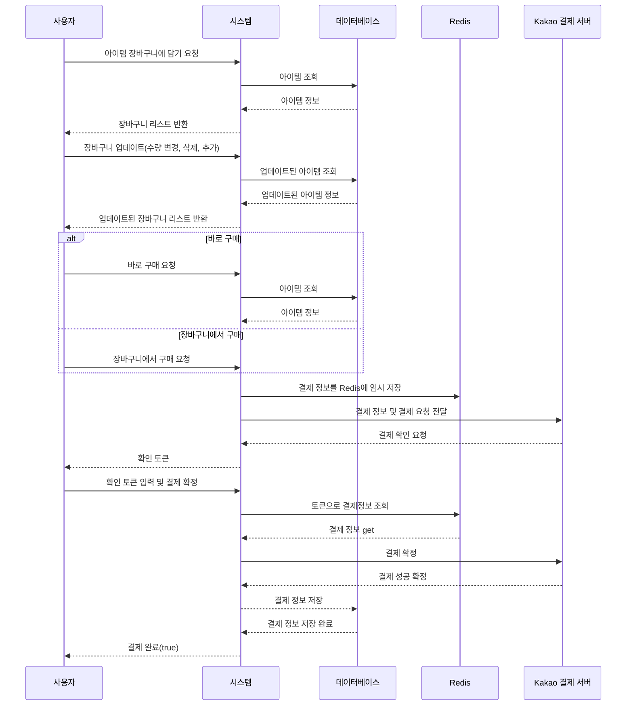

# TT Market - Tomorrow to Twentydays Market
<br />
<br />


<br />
<br />


## 프로젝트 기획 의도


TT Market은 다양한 데이터 분석을 통해 농산물 가격을 예측하고, 사용자가 효과적인 구매 결정을 할 수 있도록 돕는 통합 쇼핑몰 서비스를 생각하고 제작하였습니다. <br />
다음날부터 2주 후까지의 가격을 제공한다고해서 tomorrow to twenty days 즉 ttmarket 입니다
일조량, 강수량, 온도, 기존 시세 등을 분석하여 농산물 가격 변동을 예측하는 알고리즘을 파이썬과 머신러닝으로 구현하였습니다.<br />
<br />

이 서비스는 실시간 가격 변동 및 예측 정보를 제공하여 사용자들이 더 합리적인 구매 결정을 내릴 수 있도록 합니다. <br />
또한, 사용자 리뷰 공유와 레시피 서비스를 제공하여 농산물을 효과적으로 활용할 수 있도록 하였습니다.<br />
<br />

TT Market을 통해 사용자들은 농산물 구매에서 보다 정보에 기반한 결정을 내릴 수 있게 되었습니다.<br />

<br />
<br />
<br />


## Tech Stack

#### Frontend


#### Backend


#### Database


#### Deploy


<br />
<br />
<br />
## 기능 요약

<br /><br />

<br /><br />
<br />  <br />  <br />  
## 팀원 구성

| 정다운(팀장) | 유경우 | 김형진 | 윤주아 |
|:---:|:---:|:---:|:---:|
|  |  |  |  |
| [GitHub](깃헙링크) | [GitHub](깃헙링크) | [GitHub](깃헙링크) | [GitHub](깃헙링크) |

## 진행 일정

  
**2023년 8월 1일 → 2023년 10월 6일**

## 역할 분담

### 🌐 유경우 | Spring & Machine Learning
- 구글, 네이버 로그인 관련 기능
- 카카오 페이와 관련된 결제 및 환불 처리
- 상품, 공동구매, 문의 기능 구현 및 예외 처리
- 데이터 분석 및 모델링 작업

### 🎨 윤주아 | React
- 마이페이지, 상품 페이지 기능 구현
- 사용자 문의 및 리뷰 기능 개발
- 이벤트 상품 페이지 작업

### 🔧 김형진 | React & Infra
- OAuth 및 상품 관련 기능 구현
- 조율 및 장바구니 기능 개발
- 인프라 설정 및 CI/CD 파이프라인 구축

### 👩‍💼 정다운 | Spring & React
- 로그인, 회원 관리 및 프로필 기능 구현
- 농산물 가격 예측 및 레시피 관련 작업
- 관리자 페이지 및 UI 컴포넌트 개발

<br />
<br />

## 프로젝트 기능 설명

### 시작 화면
<br />  
서비스에 들어오면 상단에는 카테고리, 중단에는 크로셀과 신상품 알림, 하단에는 가격 예측 테이블이 위치하고 있습니다.<br /><br />
- 신상품 알림: <br /> 최근에 등록된 상품 4개가 추천됩니다.<br /><br />
- 가격 예측 테이블:  <br /> 표와 그래프 모드를 전환할 수 있는 토글과 각종 야채의 종류에 따라 그래프색이 달라집니다.<br /><br />

### 회원가입 및 로그인
<br />  
회원 가입 및 로그인은 모두 oauth로 진행하도록 하였습니다. 최초 가입시 oauth 서버에서 최소한의 정보만 가져오게 하고, 전화번호나 주소 등 나머지 정보는 사용자의 의지에 따라 입력하도록 하였습니다.<br /><br />

### 상품 리스트
<br />  
상품리스트는 상품의 재배 방법과 어떤 농가에서 생산된 제품인지, 제품 이미지와 리뷰 및 할인률을 볼 수 있습니다. 생산지나 재배 방법, 야채의 종류에 따라 필터링이 가능합니다.<br /><br />

### 공동구매
<br />  
공동 구매 상품은 달성량에 따라 할인률이 커지는 상품입니다. 현재 참여인원과 남은 일자를 볼 수 있습니다.<br /><br />

### 상품 상세보기
<br />  
상품 상세보기 페이지에서는 대표 이미지와 상세 이미지들, 기본적인 옵션, 개수 등을 지정하여 장바구니에 넣거나 바로 구입할 수 있습니다.<br /><br />
<br />  
하단에는 상품 상세 설명을 등록자가 직접 기입할 수 있습니다.<br /><br />

### 장바구니
<br />  
사용자가 상품을 담으면 리스트 형태로 서버에 임시 저장되며, 체크 박스와 -, + 버튼으로 상품의 상태를 업데이트 및 삭제할 수 있습니다. 가격 밑에는 전체상품 주문과 선택 상품 주문 버튼을 나누어 선택적 주문을 할 수 있게 하였습니다.<br /><br />

### 주문하기
<br />  
주문하기 페이지에서는 장바구니의 상품을 주문할 수 있으며, 주소나 전화번호 등 사용자 정보를 기입하거나 업데이트 할 수 있습니다.<br /><br />
<br />  
결제는 카카오 결제 API를 사용하였습니다.<br /><br />

### 주문 목록
<br />  
주문한 상품에 따라 배송중이라면 주문 취소 요청 버튼이, 주문이 완료되었다면 환불 버튼이 나옵니다. 리뷰하기 버튼도 주문 완료 후 활성화됩니다.<br /><br />

### 레시피
<br />  
레시피 페이지에서는 요리의 제목과 이미지, 조리 내용 등을 기입할 수 있습니다. 댓글 기능을 통해 사용자 간 의견을 나눌 수 있습니다.<br /><br />

### 문의하기
<br />  
사용자는 관리자에게 문의를 남길 수 있으며, 답변 완료 시 이메일 알림을 받습니다.<br /><br />
<br />  
자신이 문의했던 내용과 답변을 확인할 수 있습니다.<br /><br />

### 관리자 페이지
<br />  
관리자는 메인 페이지에서 상품의 등록 현황, 주문 목록 등을 확인하고, 상품, 판매자, 주문 관리 등을 할 수 있습니다.
<br />  <br />  

## 시퀀스 다이어그램 예시



### 계층 구조

```markdown

├─main
│  ├─java
│  │  └─com
│  │      └─dyes
│  │          └─backend
│  │              ├─config
│  │              ├─domain
│  │              │  ├─admin
│  │              │  │  ├─controller
│  │              │  │  │  └─form
│  │              │  │  ├─entity
│  │              │  │  ├─repository
│  │              │  │  └─service
│  │              │  │      └─request
│  │              │  ├─authentication
│  │              │  │  ├─controller
│  │              │  │  └─service
│  │              │  │      ├─google
│  │              │  │      │  └─response
│  │              │  │      ├─kakao
│  │              │  │      │  ├─response
│  │              │  │      │  └─service
│  │              │  │      └─naver
│  │              │  │          └─response
│  │              │  ├─cart
│  │              │  │  ├─controller
│  │              │  │  │  └─form
│  │              │  │  ├─entity
│  │              │  │  ├─repository
│  │              │  │  └─service
│  │              │  │      ├─reponse
│  │              │  │      └─request
│  │              │  ├─delivery
│  │              │  │  ├─controller
│  │              │  │  │  └─form
│  │              │  │  ├─entity
│  │              │  │  ├─repository
│  │              │  │  └─service
│  │              │  │      └─request
│  │              │  ├─event
│  │              │  │  ├─controller
│  │              │  │  │  └─form
│  │              │  │  ├─entity
│  │              │  │  ├─repository
│  │              │  │  └─service
│  │              │  │      ├─request
│  │              │  │      │  ├─delete
│  │              │  │      │  ├─modify
│  │              │  │      │  └─register
│  │              │  │      └─response
│  │              │  ├─farm
│  │              │  │  ├─controller
│  │              │  │  │  └─form
│  │              │  │  ├─entity
│  │              │  │  ├─repository
│  │              │  │  └─service
│  │              │  │      ├─request
│  │              │  │      └─response
│  │              │  │          └─form
│  │              │  ├─farmproducePriceForecast
│  │              │  │  ├─controller
│  │              │  │  │  └─form
│  │              │  │  ├─entity
│  │              │  │  ├─repository
│  │              │  │  └─service
│  │              │  │      ├─request
│  │              │  │      └─response
│  │              │  ├─inquiry
│  │              │  │  ├─controller
│  │              │  │  │  └─form
│  │              │  │  ├─entity
│  │              │  │  ├─repository
│  │              │  │  └─service
│  │              │  │      ├─request
│  │              │  │      └─response
│  │              │  │          └─read
│  │              │  ├─order
│  │              │  │  ├─controller
│  │              │  │  │  └─form
│  │              │  │  ├─entity
│  │              │  │  ├─repository
│  │              │  │  └─service
│  │              │  │      ├─admin
│  │              │  │      │  └─response
│  │              │  │      │      └─form
│  │              │  │      └─user
│  │              │  │          ├─request
│  │              │  │          └─response
│  │              │  │              └─form
│  │              │  ├─payment
│  │              │  │  ├─entity
│  │              │  │  ├─repository
│  │              │  │  └─service
│  │              │  │      ├─request
│  │              │  │      └─response
│  │              │  ├─product
│  │              │  │  ├─controller
│  │              │  │  │  ├─admin
│  │              │  │  │  │  └─form
│  │              │  │  │  └─user
│  │              │  │  ├─entity
│  │              │  │  ├─repository
│  │              │  │  └─service
│  │              │  │      ├─admin
│  │              │  │      │  ├─request
│  │              │  │      │  │  ├─delete
│  │              │  │      │  │  ├─modify
│  │              │  │      │  │  └─register
│  │              │  │      │  └─response
│  │              │  │      │      └─form
│  │              │  │      └─user
│  │              │  │          └─response
│  │              │  │              └─form
│  │              │  ├─recipe
│  │              │  │  ├─controller
│  │              │  │  │  └─form
│  │              │  │  ├─entity
│  │              │  │  ├─repository
│  │              │  │  └─service
│  │              │  │      ├─request
│  │              │  │      └─response
│  │              │  │          └─form
│  │              │  ├─review
│  │              │  │  ├─controller
│  │              │  │  │  └─form
│  │              │  │  ├─entity
│  │              │  │  ├─repository
│  │              │  │  └─service
│  │              │  │      ├─request
│  │              │  │      └─response
│  │              │  │          └─form
│  │              │  └─user
│  │              │      ├─controller
│  │              │      │  └─form
│  │              │      ├─entity
│  │              │      ├─repository
│  │              │      └─service
│  │              │          ├─request
│  │              │          └─response
│  │              │              └─form
│  │              └─utility
│  │                  ├─common
│  │                  ├─nickName
│  │                  ├─number
│  │                  ├─provider
│  │                  └─redis
│  └─resources
└─test
    └─java
        └─com
            └─dyes
                └─backend
                    ├─adminTest
                    ├─cartTest
                    ├─eventTest
                    ├─farmproducePriceForecastTest
                    ├─farmTest
                    ├─inquiryTest
                    ├─orderTest
                    ├─paymentTest
                    ├─productTest
                    │  ├─admin
                    │  └─user
                    ├─reviewTest
                    └─userTest
